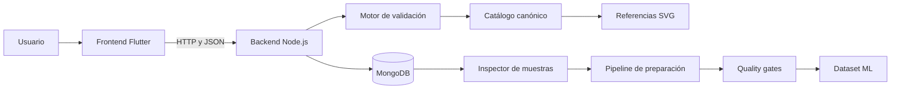

# Kanji App

> Aplicación multiplataforma para practicar la escritura de kanji, validar trazos y construir datasets reproducibles para experimentación con reconocimiento y aprendizaje automático.


## Idiomas

- **Español**, este documento
- [English](README.en.md), pendiente
- [日本語](README.ja.md), pendiente

## Descripción

Kanji App es un proyecto personal de aprendizaje que combina una interfaz Flutter, un backend Node.js y un pipeline experimental para analizar dibujos manuscritos de kanji.

El motor funciona como un **validador dirigido**. La aplicación conoce el kanji que se espera, obtiene su referencia canónica y compara los trazos del usuario con descriptores y características geométricas. No pretende ser un OCR abierto capaz de reconocer cualquier carácter sin contexto.

El proyecto también permite recopilar muestras etiquetadas manualmente, revisarlas, comprobar su calidad y preparar datasets reproducibles para futuros modelos de aprendizaje automático.

> [!IMPORTANT]
> Este repositorio se desarrolla principalmente como afición, proyecto formativo y entorno de experimentación. Aunque incorpora tests, quality gates y prácticas razonables de seguridad, no debe interpretarse actualmente como una solución profesional, educativa certificada ni preparada para producción a gran escala.

## Capturas de pantalla

### Práctica de escritura

> 📷 Captura pendiente: pantalla de dibujo y validación.

<!--
<p align="center">
  
</p>
-->

### Comparación de trazos

> 📷 Captura pendiente: dibujo del usuario frente a la referencia SVG.

<!--
<p align="center">
  
</p>
-->

### Revisión de muestras

> 📷 Captura pendiente: galería móvil de muestras almacenadas en MongoDB.

<!--
<p align="center">
  
</p>
-->

## Funcionalidades

### Frontend Flutter

- Práctica de escritura mediante trazos dibujados por el usuario.
- Selección de niveles y contenidos.
- Validación contra el kanji esperado.
- Presentación de puntuación y resultado.
- Captura deliberada de muestras correctas e incorrectas.
- Modo experimental de recopilación para entrenamiento.
- Revisión móvil de muestras de MongoDB en modo de sólo lectura.
- Galería, detalle ampliado, navegación y orden de trazos opcional.

### Backend Node.js

- API HTTP para la aplicación Flutter.
- Persistencia de muestras y metadatos en MongoDB.
- Separación entre feedback automático y etiquetas humanas deliberadas.
- Funciones administrativas de revisión protegidas.
- Catálogo canónico incremental de referencias.
- Catálogo runtime reducido para despliegues con memoria limitada.
- Herramientas CLI de auditoría, importación, inspección y validación.

### Pipeline de validación y ML

- Extracción de características geométricas.
- Generación y calibración de descriptores por kanji.
- Procesamiento individual y batch.
- Quality gates contra regresiones y falsos negativos.
- Sugerencias y propuestas FP-safe.
- Exportación reproducible del dataset ML.
- Baseline ML experimental.
- Regresión exacta entre referencias históricas y catálogo incremental.

## Arquitectura



## Estructura del repositorio

```text
kanji_app/
├── backend/
│   ├── data/                 # Catálogo, manifiesto, requisitos y descriptores
│   ├── kanji_svg/            # Referencias SVG
│   ├── ml_datasets/          # Datasets ML reproducibles
│   ├── ml_models/            # Baselines y evaluaciones
│   ├── routes/               # Rutas HTTP
│   ├── scripts/              # CLI, pipelines y quality gates
│   ├── services/             # Lógica reutilizable
│   ├── tests/                # Tests unitarios, integración y regresión
│   ├── package.json
│   └── server.js
├── frontend/
│   ├── assets/               # Lecciones y recursos
│   ├── lib/                  # Código Dart
│   ├── test/                 # Tests Flutter
│   └── pubspec.yaml
└── README.md
```

## Referencias canónicas

El proyecto distingue dos artefactos:

- `backend/data/kanji_reference_catalog.json`: catálogo canónico incremental, versionable y empleado por los pipelines analíticos.
- `backend/kanji_runtime.json`: subconjunto generado para el servidor desplegado, separado para reducir consumo de memoria.

El catálogo incremental dispone de manifiesto, hashes y comprobaciones de integridad. Contiene las referencias baseline aceptadas y mantiene `力` como caso `external_unseen`.

## Estado actual

### Completado

- Catálogo incremental con manifiesto y hashes.
- Regresión exacta de las referencias baseline.
- Generación directa de `kanji_runtime.json` desde el conversor SVG compartido.
- Migración de consumidores, pipeline individual, batch y quality gates.
- Sugerencias y propuestas FP-safe.
- Exportación y validación del dataset ML.
- Importación idempotente de muestras legacy válidas a MongoDB.
- Inspector MongoDB estrictamente de sólo lectura.
- Revisión móvil protegida mediante clave administrativa.
- Tests unitarios, de integración y regresión para los flujos principales.

### Línea base validada

```text
Referencias baseline:       19
External unseen:             力
Filas del dataset ML:       565
Etiquetas positivas:        383
Etiquetas negativas:        182
Features:                    131
Errores del pipeline:          0
```

### Pendiente

- Exportar conjuntamente las muestras nuevas o modificadas de MongoDB.
- Reconstruir features ausentes cuando sea seguro.
- Generar snapshots candidatos con manifiesto y hashes.
- Registrar aceptaciones por alcance tras superar los quality gates.
- Completar el emparejamiento de dispositivos mediante tokens revocables.
- Añadir Settings para vincular y desvincular dispositivos.
- Incorporar una vista pedagógica de comparación.
- Mostrar qué kanji tienen muestras y añadir filtros.
- Ampliar catálogo, dataset y evaluación ML sin contaminar la línea base.
- Seguir mejorando documentación, observabilidad y CI/CD.

## Requisitos

- Node.js y npm.
- Flutter SDK y Dart.
- Android Studio, Visual Studio Code u otro IDE compatible.
- Emulador, dispositivo móvil o destino de escritorio Flutter.
- Acceso a MongoDB para las funciones persistentes.

```bash
node --version
npm --version
flutter --version
flutter doctor
```

## Configuración segura

Los secretos no deben guardarse en Git ni incluirse en Flutter. Configura las variables necesarias en el entorno local o en el proveedor de despliegue:

```dotenv
MONGO_URI=mongodb://...
REVIEW_ADMIN_KEY=...
```

`REVIEW_ADMIN_KEY` debe permanecer únicamente en el backend o en un gestor de secretos.

## Cómo lanzar el proyecto

### Backend

```bash
cd backend
npm install
npm start
```

`npm start` comprueba primero `kanji_runtime.json` mediante `prestart` y después inicia `server.js`.

Para regenerar el runtime:

```bash
npm run generate:kanji-runtime
npm run check:kanji-runtime
npm start
```

### Frontend Flutter

En otra terminal:

```bash
cd frontend
flutter pub get
flutter run
```

Para elegir dispositivo:

```bash
flutter devices
flutter run -d <device-id>
```

Ejemplos:

```bash
flutter run -d chrome
flutter run -d windows
```

## Comandos npm importantes

Ejecuta estos comandos desde `backend/`.

### Ejecución y tests

| Comando                    | Descripción                                |
| -------------------------- | ------------------------------------------ |
| `npm start`                | Comprueba el runtime e inicia el servidor. |
| `npm test`                 | Ejecuta la suite completa de Node.js.      |
| `npm run test:unit`        | Ejecuta los tests unitarios.               |
| `npm run test:integration` | Ejecuta los tests de integración.          |
| `npm run test:regression`  | Ejecuta las regresiones versionadas.       |

### Catálogo y runtime

| Comando                                | Descripción                                         |
| -------------------------------------- | --------------------------------------------------- |
| `npm run generate:kanji-runtime`       | Genera las referencias necesarias para el servidor. |
| `npm run check:kanji-runtime`          | Comprueba que el runtime existe y es utilizable.    |
| `npm run reference:catalog:dry-run`    | Calcula cambios del catálogo sin escribir archivos. |
| `npm run reference:catalog:update`     | Aplica la actualización incremental.                |
| `npm run reference:catalog:check`      | Verifica catálogo, manifiesto, cobertura y hashes.  |
| `npm run reference:catalog:regression` | Compara el baseline con el dataset histórico local. |

### Quality gates

| Comando                                           | Descripción                                        |
| ------------------------------------------------- | -------------------------------------------------- |
| `npm run test:descriptor-quality`                 | Evalúa la calidad de los descriptores.             |
| `npm run test:reference-candidate-quality`        | Genera y valida candidatos basados en referencias. |
| `npm run test:reference-candidate-fp-suggestions` | Busca reducciones FP sin aumentar FN.              |
| `npm run test:reference-candidate-fp-patches`     | Genera propuestas FP-safe revisables.              |
| `npm run test:reference-candidate-ml-dataset`     | Exporta y valida el dataset ML.                    |
| `npm run report:descriptor-coverage`              | Genera el informe de cobertura.                    |

### Datos y MongoDB

| Comando                          | Descripción                                                |
| -------------------------------- | ---------------------------------------------------------- |
| `npm run audit:feedback-jsonl`   | Audita las muestras del JSONL.                             |
| `npm run import:feedback-jsonl`  | Importa el JSONL a MongoDB con controles de idempotencia.  |
| `npm run inspect:mongo-feedback` | Inspecciona MongoDB en modo estrictamente de sólo lectura. |

> [!CAUTION]
> Utiliza primero las opciones `dry-run` disponibles. No escribas cadenas de conexión ni secretos en el historial del terminal.

## Flujo de validación recomendado

```bash
npm run reference:catalog:check
npm run test:descriptor-quality
npm run test:reference-candidate-quality
npm run test:reference-candidate-fp-suggestions
npm run test:reference-candidate-fp-patches
npm run test:reference-candidate-ml-dataset
npm test
```

Para actualizar referencias:

```bash
npm run reference:catalog:dry-run
npm run reference:catalog:update
npm run reference:catalog:check
npm run reference:catalog:regression
npm test
```

## Calidad y seguridad de los datos

El proyecto separa:

- etiquetas humanas deliberadas;
- feedback automático o desconocido;
- muestras pendientes, aprobadas, excluidas o que requieren revisión;
- datos vivos en MongoDB y exportaciones JSONL reproducibles.

Principios aplicados:

- `recognitionId` único para trazabilidad e idempotencia.
- Secretos fuera del código.
- Acceso administrativo protegido.
- Inspección MongoDB de sólo lectura.
- Minimización de datos en logs.
- Quality gates antes de aceptar datasets o descriptores.
- `力` reservado como evaluación externa y no mezclado automáticamente con el baseline.

## Contribuciones

Las sugerencias y contribuciones son bienvenidas, teniendo en cuenta el carácter experimental del proyecto.

1. Crea una rama descriptiva.
2. Mantén el cambio pequeño y enfocado.
3. Añade o actualiza tests.
4. Ejecuta los quality gates afectados.
5. Ejecuta `npm test` y los tests Flutter correspondientes.
6. No incluyas secretos ni artefactos temporales.
7. Abre una pull request explicando el cambio y las pruebas realizadas.

## Limitaciones conocidas

- El reconocimiento es dirigido, no un OCR abierto.
- La cobertura depende de referencias, descriptores y muestras.
- El baseline ML es experimental y el dataset es todavía pequeño.
- El resultado depende de la captura de trazos y del dispositivo.
- Algunas herramientas requieren configuración local manual.
- No existe compromiso actual de soporte o compatibilidad a largo plazo.

## Licencia

Consulta `LICENSE` para conocer las condiciones aplicables. Si todavía no existe, conviene añadirlo antes de distribuir públicamente el proyecto.

## Autor

Proyecto personal desarrollado por Eduardo Estañan Hermida.
